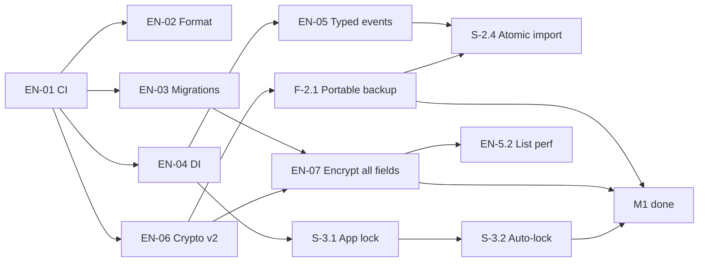

# Kupass Roadmap: Epics, Features, Stories

> Built with the `breakdown-plan` skill on 2026-09-18 from `docs/ai/prd.md` (backlog + §8 Decision Log) and `docs/codebase/CONCERNS.md`. Adapted for a small team: no sprints or velocity, just ordered milestones, dependencies, and estimates.
>
> Each item ID (e.g. `EN-06`) is meant to become one GitHub issue and one branch (`feat/…`, `fix/…`, `chore/…`). Update the checkboxes and IDs here as issues are created and merged.

## 0. Progress (updated 2026-09-19)

- **M1 Trustworthy Vault: done**, merged to `master` in PR #2: EN-00, EN-01, EN-03, EN-06 (+EN-06b), F-2.1, EN-04, S-3.1, S-3.2, EN-07, EN-05, S-2.4, S-2.5, S-3.3, plus a security-review fix for the app lock.
- **M0 Foundation: done.** EN-02 (Spotless/ktfmt + detekt with Compose rules, 0 findings, enforced in CI) is on `build/format-and-static-analysis`.
- **Next:** M2 (Polish & Light), then F-7.2 Autofill.

## 1. Overview

**Goal:** turn Kupass v3.1 (a working local vault with known security gaps) into a password manager that is secure, has few bugs, performs well, and stays light, without ever adding telemetry.

**Success criteria (measurable, no telemetry needed)**

- 0 open `Critical`/`High` items in `CONCERNS.md` §1.
- CI green on every PR: build, unit tests, lint (0 errors), format check.
- A backup exported on phone A restores correctly on phone B with the backup password (automated test + manual check).
- The vault opens only after biometric/device-credential authentication.
- Release APK size is recorded per release. The target is < 8 MB (proposed), and the font subset should cut the current ~3.9 MB font substantially.
- Every Room schema change ships with a migration test.

**Milestones** (the app version stays `3.1.0`; milestones are not releases, see the Decision Log)

| Milestone                | Theme                                                            | Exit criteria                                              |
| ------------------------ | ---------------------------------------------------------------- | ---------------------------------------------------------- |
| **M0 Foundation**        | Tooling and safety nets that every later change depends on       | CI + format + migration harness + DI + typed errors merged |
| **M1 Trustworthy Vault** | Crypto hardening, portable backups, app lock                     | C-1…C-4, C-6, C-7 closed                                   |
| **M2 Polish & Light**    | Reliability, UX, performance, APK size, feedback                 | REL-3/4, QA-3, FEAT-5, perf items done                     |
| **M3 Features**          | Autofill (first), generator, favicons, organization, adaptive UI | Per feature                                                |

**Top risks**

| Risk                                                                                              | Impact                                 | Mitigation                                                                                                           |
| ------------------------------------------------------------------------------------------------- | -------------------------------------- | -------------------------------------------------------------------------------------------------------------------- |
| Crypto/format changes corrupt or lock out existing vaults                                         | Data loss (the worst possible outcome) | Versioned ciphertext, read-old/write-new, migration tests, never delete the old key before re-encryption succeeds    |
| Encrypting `site_name`/`username` breaks SQL `LIKE` search                                        | Search stops working                   | Decide the search strategy first (Q1). In-memory search over decrypted rows is fine for vault sizes ≤ a few thousand |
| Biometric lock + Keystore auth binding can make keys unusable after a biometric enrollment change | Vault lockout                          | Don't bind the vault key to user auth in M1 (Q3). Gate the UI instead                                                |
| Single maintainer                                                                                 | Slow review                            | Small PRs, CI as the reviewer of record, `/code-review` on every PR                                                  |

## 2. Work Item Hierarchy

```mermaid
graph TD
    M0[M0 Foundation] --> E1[Epic E1: Quality & Delivery]
    M1[M1 Trustworthy Vault] --> E2[Epic E2: Data Protection]
    M1 --> E3[Epic E3: App Lock]
    M2[M2 Polish & Light] --> E4[Epic E4: Reliability & UX]
    M2 --> E5[Epic E5: Lightweight & Fast]
    M2 --> E6[Epic E6: Feedback]
    M3[M3 Features] --> E7[Epic E7: Power Features]

    E1 --> EN01[EN-01 CI workflow]
    E1 --> EN02[EN-02 ktfmt + detekt]
    E1 --> EN03[EN-03 Room schema + migration harness]
    E1 --> EN04[EN-04 AppContainer DI]
    E1 --> EN05[EN-05 Typed events + error UI]
    E1 --> EN06a[EN-00 Repo security settings]

    E2 --> EN06[EN-06 CryptoManager v2 fail-closed]
    E2 --> F21[F-2.1 Portable backup]
    E2 --> S24[S-2.4 Atomic import + dedupe]
    E2 --> EN07[EN-07 Encrypt all fields]
    E2 --> S25[S-2.5 Backup/D2D exclusion]

    E3 --> S31[S-3.1 Unlock on launch]
    E3 --> S32[S-3.2 Auto-lock timeout]
    E3 --> S33[S-3.3 Clipboard auto-clear]
```

## 3. Epics, Features, Stories

Estimates use story points (1 < 4 h · 2 < 1 day · 3 = 1–2 days · 5 = 3–5 days · 8 = 1–2 weeks · 13 = must split). Priorities: P0 blocks a trustworthy release, P1 core, P2 important, P3 nice to have.

### Epic E1: Quality & Delivery Foundation (M0, size M)

Enablers only. They make every later change safer and cheaper.

| ID    | Type    | Title                                                                                                                                                                                  | Pts | Pri | Blocked by | Source                     |
| ----- | ------- | -------------------------------------------------------------------------------------------------------------------------------------------------------------------------------------- | --- | --- | ---------- | -------------------------- |
| EN-00 | Enabler | Enable Dependabot alerts, security updates, secret scanning + push protection (repo settings)                                                                                          | 1   | P1  | none       | CONCERNS, Dependabot check |
| EN-01 | Enabler | CI workflow: `assembleDebug`, `testDebugUnitTest`, `lintDebug` on push/PR to `master`; hardened (pinned SHAs, `permissions: {}`); Gradle `dependency-submission` for Dependabot alerts | 3   | P0  | none       | QA-2                       |
| EN-02 | Enabler | Formatter + static analysis: ktfmt (or ktlint) + detekt in Gradle, a one-time format commit, and a CI check                                                                            | 3   | P1  | EN-01      | QA-1                       |
| EN-03 | Enabler | Room `exportSchema = true` + committed schema JSON + `MigrationTestHelper` harness (no schema change yet)                                                                              | 3   | P0  | EN-01      | REL-1, C-5                 |
| EN-04 | Enabler | Lightweight DI: `AppContainer` in `App`, `ViewModelProvider.Factory`, repository injected. Enables ViewModel tests                                                                     | 3   | P1  | EN-01      | Tech debt                  |
| EN-05 | Enabler | Typed one-shot events (`sealed interface` + `Channel`) replacing string keys. Render `SaveState.Error`/`DeleteState.Error`. Switch to `collectAsStateWithLifecycle`                    | 3   | P1  | EN-04      | C-8, C-9, tech debt        |

**Acceptance:** CI blocks merges on failure. Formatter is enforced. The schema JSON exists in the repo. ViewModels have at least one unit test each.

### Epic E2: Data Protection (M1, size L)

| ID        | Type    | Title                                                                                                                                                                                                                                                              | Pts | Pri | Blocked by    | Source          |
| --------- | ------- | ------------------------------------------------------------------------------------------------------------------------------------------------------------------------------------------------------------------------------------------------------------------ | --- | --- | ------------- | --------------- |
| EN-06     | Enabler | **CryptoManager v2**: fail-closed (typed `CryptoException`, no plaintext fallback, no `printStackTrace`), versioned ciphertext prefix (`v2:`), legacy read path for existing rows, run crypto off the main thread                                                  | 5   | P0  | EN-01         | C-2, SEC-4      |
| EN-06b    | Test    | Instrumented test for the real AndroidKeyStore path (encrypt/decrypt/versioning) on an emulator                                                                                                                                                                    | 2   | P0  | EN-06         | TESTING gaps    |
| **F-2.1** | Feature | **Portable encrypted backup** (confirmed decision)                                                                                                                                                                                                                 | 11  | P0  | EN-06         | SEC-1, C-1      |
| EN-2.1a   | Enabler | Backup format v2: JSON envelope `{format, version, kdf, iterations, salt, iv, ciphertext}`, key from backup password via **PBKDF2-HMAC-SHA256** (platform API, no new dependency, decided Q2), AES-256-GCM over the whole payload (all fields, not just passwords) | 5   | P0  | EN-06         | SEC-1           |
| S-2.1b    | Story   | As a user, I set a backup password when exporting (confirm field, strength hint, "can't be recovered" warning) so that I can restore on another phone                                                                                                              | 3   | P0  | EN-2.1a       | SEC-1           |
| S-2.1c    | Story   | As a user, I enter the backup password when importing. A wrong password shows a clear error, and a legacy v1 file imports only if this device can decrypt it, otherwise it's rejected (never imported as ciphertext)                                               | 3   | P0  | EN-2.1a       | C-1             |
| S-2.4     | Story   | As a user, import is all-or-nothing (`withTransaction`), skips duplicates, and shows "X imported, Y skipped". The file size is checked before parsing                                                                                                              | 3   | P1  | EN-05, S-2.1c | REL-2, C-7, C-8 |
| EN-07     | Enabler | Encrypt `site_name`, `username`, `url`, `notes` at rest. Room migration v1→v2 re-encrypts existing rows. Search moves to in-memory over decrypted rows (decided, Q1)                                                                                               | 8   | P0  | EN-03, EN-06  | SEC-3, C-3      |
| S-2.5     | Story   | Exclude `database` and `sharedpref` from `cloud-backup` and `device-transfer` in `data_extraction_rules.xml`. Tidy `backup_rules.xml`                                                                                                                              | 1   | P1  | none          | SEC-5, C-6      |

**Acceptance:** a phone-A → phone-B restore works. A wrong password never imports garbage. No plaintext vault field in the DB file or the backup. The migration test passes from a v1 DB with real data.

### Epic E3: App Lock (M1, size M)

Confirmed decision: biometric with device-credential fallback, no master password.

| ID    | Type  | Title                                                                                                                                                                     | Pts | Pri | Blocked by | Source             |
| ----- | ----- | ------------------------------------------------------------------------------------------------------------------------------------------------------------------------- | --- | --- | ---------- | ------------------ |
| S-3.1 | Story | As a user, the vault requires `BiometricPrompt` (`BIOMETRIC_STRONG or DEVICE_CREDENTIAL`) on launch. If the device has no lock screen, show guidance instead of the vault | 5   | P0  | EN-04      | SEC-2, C-4         |
| S-3.2 | Story | As a user, the app re-locks after N seconds in the background (setting: immediately / 30 s / 1 min / 5 min)                                                               | 3   | P0  | S-3.1      | SEC-2              |
| S-3.3 | Story | As a user, a copied password is cleared from the clipboard after a timeout on every API level (27–37), not only < 33                                                      | 2   | P1  | none       | SEC-6, CONCERNS §3 |

**Acceptance:** no vault data is composed before a successful auth. Tested on API 27, 30, 33, and 37 emulators.

### Epic E4: Reliability & UX (M2, size M)

| ID     | Type    | Title                                                                                                                                           | Pts | Pri | Blocked by | Source    |
| ------ | ------- | ----------------------------------------------------------------------------------------------------------------------------------------------- | --- | --- | ---------- | --------- |
| S-4.1  | Story   | Undo delete via snackbar (in addition to the confirm dialog)                                                                                    | 3   | P1  | EN-05      | REL-3     |
| S-4.2  | Story   | Localize the remaining hardcoded strings (EN + ID) and fix `ButtonCase`                                                                         | 2   | P1  | none       | REL-4     |
| EN-4.3 | Enabler | `SettingsViewModel`: move prefs I/O out of composition. Remove the duplicate dynamic-color path if it's unneeded                                | 3   | P2  | EN-04      | Tech debt |
| EN-4.4 | Enabler | Code hygiene: unused code/resources (keep the Favget hooks), the `TextField.kt` package mismatch, duplicated nav transitions, placeholder tests | 2   | P2  | EN-02      | Tech debt |

### Epic E5: Lightweight & Fast (M2, size S)

| ID     | Type    | Title                                                                                                                        | Pts | Pri | Blocked by   | Source            |
| ------ | ------- | ---------------------------------------------------------------------------------------------------------------------------- | --- | --- | ------------ | ----------------- |
| EN-5.0 | Enabler | Record the APK size baseline in CI (release build size in the job summary)                                                   | 1   | P1  | EN-01        | Lightweight goal  |
| S-5.1  | Story   | Subset/optimize `googlesansflex.ttf` (Latin + Indonesian glyphs, only the needed axis ranges). Keep the font                 | 3   | P1  | EN-5.0       | QA-3              |
| EN-5.2 | Enabler | List without decrypting passwords (projection), debounce search, crypto on `Dispatchers.Default`                             | 3   | P1  | EN-06, EN-07 | CONCERNS §4       |
| EN-5.3 | Enabler | Replace `material-icons-extended` with the few vector icons used. Merge `mipmap-anydpi-v26`. Move bitmaps out of `drawable/` | 2   | P2  | none         | CONCERNS §4, lint |

### Epic E6: Feedback & Bug Report (M2, size S)

| ID     | Type    | Title                                                                                                                                                                                   | Pts | Pri | Blocked by | Source |
| ------ | ------- | --------------------------------------------------------------------------------------------------------------------------------------------------------------------------------------- | --- | --- | ---------- | ------ |
| S-6.1  | Story   | Settings → "Send feedback" / "Report a bug": opens a prefilled GitHub issue or email with app version + Android version the user can see and edit. **No automatic data, no vault data** | 3   | P1  | none       | FEAT-5 |
| EN-6.2 | Enabler | GitHub issue templates (bug report / feature request) that match the in-app fields                                                                                                      | 1   | P2  | none       | FEAT-5 |

### Epic E7: Power Features (M3, size XL, to be split per feature)

| ID     | Type    | Title                                                                                                                 | Pts | Pri | Blocked by | Source        |
| ------ | ------- | --------------------------------------------------------------------------------------------------------------------- | --- | --- | ---------- | ------------- |
| S-7.1  | Story   | Password generator (length, character sets, strength meter) in the editor                                             | 5   | P2  | none       | SEC-7         |
| F-7.2  | Feature | **Android Autofill service** (proposed, needs approval): split with the `breakdown-feature-prd` skill before starting | 13+ | P1? | E2, E3     | FEAT-1        |
| S-7.3  | Story   | Opt-in favicons via Favget (domain only, cached, off by default)                                                      | 5   | P2  | EN-01      | FEAT-2        |
| S-7.4  | Story   | Categories/tags and favorites (proposed)                                                                              | 5   | P3  | EN-03      | FEAT-3        |
| S-7.5  | Story   | Adaptive list-detail layout for tablets/foldables (proposed)                                                          | 5   | P3  | none       | FEAT-4        |
| EN-7.6 | Enabler | Migrate Navigation 2.x (maintenance mode) → Navigation 3                                                              | 5   | P3  | EN-04      | CONCERNS debt |

## 4. Critical Path & Order

**Suggested order (one branch/PR each):**

1. EN-00 → EN-01 → EN-03 → EN-06 _(critical path; protects data before touching it)_
2. EN-2.1a → S-2.1b → S-2.1c _(fixes the Critical C-1)_
3. EN-04 → S-3.1 → S-3.2 _(app lock; can run in parallel with step 2)_
4. EN-07 → EN-05 → S-2.4 → S-2.5 → S-3.3 → **M1 done**
5. M2 in any order (EN-02 can move earlier if formatting churn becomes annoying)
6. M3 after deciding on Autofill

**Totals:** M0 ≈ 16 pts · M1 ≈ 40 pts · M2 ≈ 23 pts · M3 ≈ 38+ pts.

## 5. Decisions (answered by Danil, 2026-09-18)

1. **Q1 Search after full-field encryption:** decrypt in memory and filter in Kotlin. No SQLCipher.
2. **Q2 Backup KDF:** PBKDF2-HMAC-SHA256 (platform API). No Argon2 or native library.
3. **Q3 Key binding:** app lock at the **UI level only** for now. The vault key is _not_ bound to user authentication.
4. **Q4 Autofill:** an important Kupass feature. F-7.2 is P1 and is the first M3 item.
5. **Q5 Versioning:** **the app version stays `3.1.0`.** Milestones are not tied to version numbers, and agents never bump `versionName`/`versionCode`.

## 6. Issue Creation Checklist

- [ ] Labels: `epic`, `feature`, `story`, `enabler`, `test`, `P0`–`P3`, `security`, `crypto`, `ui`, `build`, `ci`
- [ ] Milestones: `M0 Foundation`, `M1 Trustworthy Vault`, `M2 Polish & Light`, `M3 Features`
- [ ] Epic issues E1–E7 with the acceptance criteria above
- [ ] One issue per ID in §3, linked to its epic, with a "Blocked by" list from the tables
- [ ] Optional: a GitHub Project board (Backlog → Ready → In Progress → In Review → Done)
- [ ] Each PR references its issue (`Closes #N`) and follows Definition of Done (`prd.md` §7)
